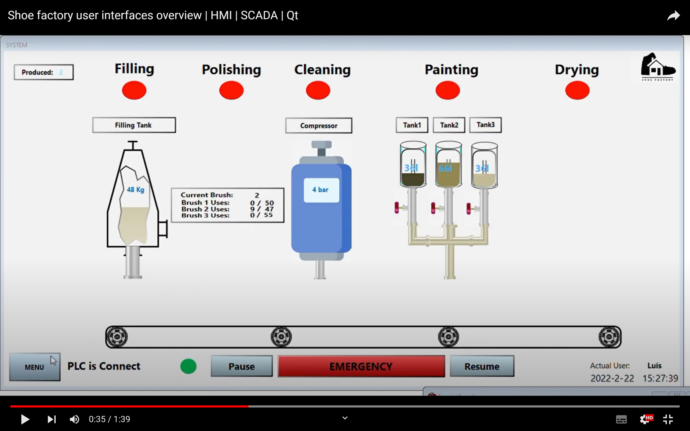
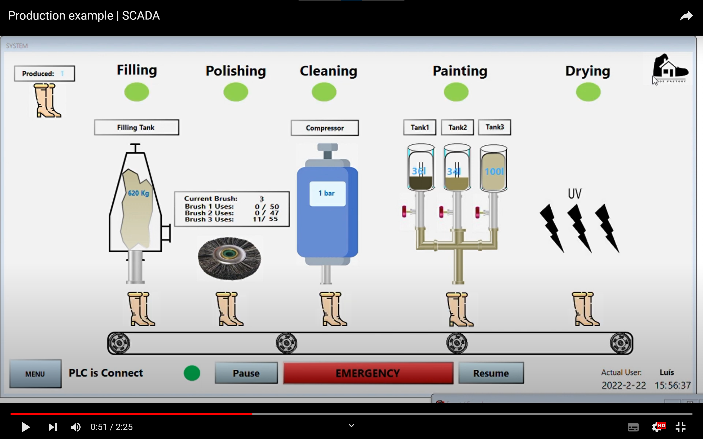
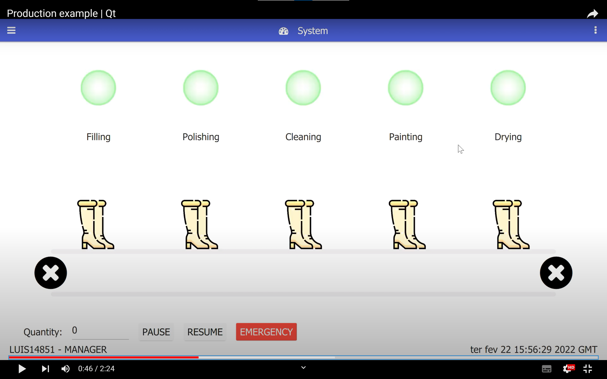

# **Automated shoe finishing process**

The present repository contains all the work developed for a master's class (Advanced Automation) at Polytechnic Institute of Cávado and Ave (IPCA) that focuses on making a PLC program and user interfaces for monitoring/control of a simulated production line (most sensors/actuators will be simulated). The developed program should also be flexible, e.g, it can support the production of slightly different products and changing the parameters for each of those should be done through the various user interface technologies that will be showcased.

The present work was done by the following:
- António Real - areal@ipca.pt
- Luís Barbosa - lbarbosa@ipca.pt
- Sérgio Pereira - sfpereira@ipca.pt

 

## Simulated production line

The group chose to do a program capable of controlling the finishing process in a shoe factory. After shoes are completed, they go through a finishing stage that has a sequence of steps (Filling, Polishing, Cleaning, Painting and Drying). Each of those steps has different parameters that can be changed depending on the type of shoe that is being produced (Shoe, Boot or High Boot) and can also be disabled entirely.

1. ***Filling*** - The shoe is filled with packing beans so it maintains its form.
    - Distance of the axis that fills the shoe, so it can be adjusted to the shoe height.
    - Time of filling (e.g. High Boot takes longer to fill than a shoe).
2. ***Polishing*** - The shoe is polished with a rotating brush.
    - Type of crush (different brushes can be chosen).
    - Time of polishing.
3. ***Cleaning*** - The shoe is cleaned with pressurized air.
    - Air pressure.
    - Time of cleaning.
4. ***Painting*** - The shoe is painted with, for example, a pneumatic paint sprayer.
    - Type of paint (e.g. choosing between different colours or varnish).
    - Time of painting.
5. ***Drying*** - The shoe can be dried with heat, UV light and also a fan.
    - Selecting which drying processes will be enabled.
    - Time that each process will work for.

 

## User interfaces

To control and monitor the PLC program, three different technologies were used to explore their capabilities:

- HMI (Human Machine Interface) - A small monitor that is typically near the machine, the interface developed was developed using NB-Designer.
- SCADA (Supervisory control and data acquisition) - A control system architecture comprising computers, networked data communications and graphical user interfaces for high-level supervision of machines and processes, in our case, developed with CX-Supervisor.
- Qt Application - An interface developed using Qt framework and C++.

 

The following video shoes an overview of the three mentioned user interfaces:

A usage example of the HMI during a production run:

A usage example of the SCADA during a production run:

A usage example of the Qt GUI during a production run:

